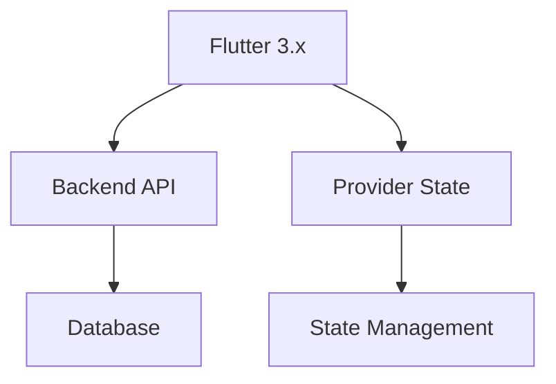

# 📦 Gudang Pro - Manajemen Stok Modern

**Gudang Pro** adalah aplikasi modern untuk mengelola stok barang secara cepat, efisien, dan real-time. Dibangun dengan Flutter untuk memberikan pengalaman lintas platform yang optimal.

*(Tampilan utama aplikasi dengan desain sederhana dan fungsional)*

---

## ✨ Fitur Unggulan

### 📦 Manajemen Stok

* 📝 Pencatatan barang masuk dan keluar dengan mudah.
* 🔍 Pencarian cepat berdasarkan nama atau kategori.
* 📊 Laporan stok real-time.
* 🗂️ Kategori barang dengan ikon khusus.

### 🛠️ Pengalaman Pengguna

* 📱 UI sederhana dan responsif.
* ➕ Tombol aksi cepat untuk menambah barang baru.
* ⚡ Navigasi menu beranda, laporan, dan pengaturan.

### 🔄 Interaksi Pengguna

* 👆 Tap pada item untuk melihat detail.
* ↔️ Geser untuk menghapus atau memperbarui data.
* 🟢 Klik tombol **+** untuk menambah stok.

---

## 📸 Galeri Aplikasi

| Fitur             | Tampilan                                                                                     |
| ----------------- | -------------------------------------------------------------------------------------------- |
| **Beranda**       |      |
| **Daftar Stok**   |     |
| **Laporan**       |    |
| **Tambah Barang** |       |
| **Pengaturan**    |  |

---

## 🚀 Instalasi Mudah

### 📱 Android

1. 📥 Download APK dari [halaman Releases](#).
2. ⚙️ Aktifkan **Instalasi dari Sumber Tidak Dikenal** di pengaturan Android.
3. 🖱️ Tap file APK untuk memulai instalasi.
4. 🎉 Buka aplikasi dan mulai kelola stok!

### 🔮 Coming Soon

* 🍏 **iOS App Store** - Dalam pengembangan.
* 🌐 **Versi Web** - Tahap perencanaan.
* 🖥️ **Desktop App** - Konsep awal.

---

## 👥 Tim Pengembang

|            | **Nama Developer 1** | **Nama Developer 2** | **Nama Developer 3** |
| :--------: | :------------------: | :------------------: | :------------------: |
|  **Role**  |   Flutter Developer  |    UI/UX Designer    |   Backend Engineer   |
| **GitHub** |  RendiSkuy           |      Fahmi Fauzan   |              Aqsa55312   |
|  **Fokus** |  Fitur & Performance |     Design System    |    API Integration   |

### 🏆 Kontribusi

* **Developer 1 Rendi Ripaldi**: Arsitektur aplikasi, optimisasi performa.
* **Developer 2 Fahmi Fauzan**: Design system, prototyping.
* **Developer 3 Zurisky Aqsa**: API integration, database.

---

## 🛠️ Teknologi Utama

### Tech Stack:

* **Frontend**: Flutter 3.x, Dart.
* **Backend**: Node.js / .
* **Database**: MySQL / Exspress
* **State Management**: Provider.

---

## 📊 Statistik Proyek

---

## 🤝 Berkontribusi

1. **Fork** repository ini.
2. **Buat branch** fitur baru: `git checkout -b feature/nama-fitur`.
3. **Commit** perubahan: `git commit -m 'Add: fitur baru'`.
4. **Push** ke branch: `git push origin feature/nama-fitur`.
5. **Buat Pull Request** dengan deskripsi jelas.

### 🐛 Melaporkan Bug

Gunakan Issues untuk melaporkan bug dengan detail:

* Device dan versi OS.
* Langkah reproduksi bug.
* Screenshot jika ada.

---

## 📋 Roadmap

### Version 1.1 (Q3 2025)

* [ ] Laporan ekspor ke PDF/Excel.
* [ ] Dukungan multi-bahasa.
* [ ] Pencarian lanjutan.

### Version 1.2 (Q4 2025)

* [ ] iOS App Store release.
* [ ] Versi Web.
* [ ] Mode offline.

---

## 📄 Lisensi

Proyek ini dilisensikan di bawah **MIT License** - lihat file LICENSE untuk detail lengkap.

---

## 📞 Dukungan

* 📧 Email: RendiRipaldi225@gmail.com
* 💬 GitHub Issues: 

---

**Dibuat dengan ❤️ oleh Tim Gudang Pro**

*"Solusi pintar untuk manajemen stok modern"*

⭐ **Jika project ini bermanfaat, berikan star untuk mendukung pengembangan!**

